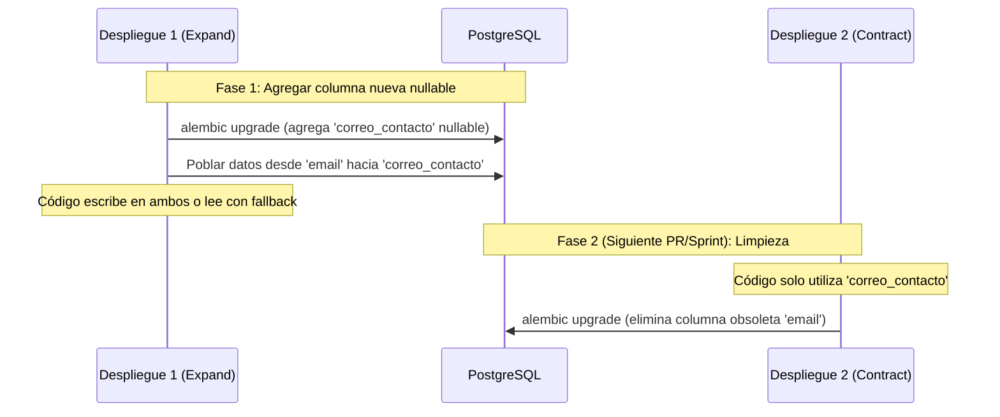

# Guía Operativa de Migraciones con Alembic y Troubleshooting

Esta guía es el manual de referencia práctico para gestionar el esquema de la base de datos PostgreSQL en **Chiripa**, crear migraciones seguras y resolver cualquier conflicto o desincronización con **Alembic**.

---

## 1. Fundamentos y Reglas del Proyecto

En el backend de Chiripa existen dos capas claramente diferenciadas para el manejo de datos:

1. **SQLModel (`app/domain/` y `app/infrastructure/repositories/`)**: Define las entidades de negocio, tipos de datos y validaciones en Python.
2. **Alembic (`monorepo/backend/alembic/`)**: Gestiona la evolución del esquema físico en PostgreSQL (tablas, columnas, índices, llaves foráneas y restricciones).

### Reglas críticas de arquitectura

> [!WARNING]
> **Prohibido usar `SQLModel.metadata.create_all`:**
> `create_all` crea las tablas inexistentes pero **ignora por completo cualquier cambio en tablas existentes** (columnas nuevas, tipos o restricciones quedan fuera en silencio). El esquema se gestiona **únicamente** con migraciones versionadas de Alembic.

> [!IMPORTANT]
> **Compatibilidad hacia atrás (Zero-Downtime):**
> En Railway, las migraciones corren en el `preDeployCommand` (definido en `monorepo/backend/railway.toml`). Esto significa que se ejecutan **antes** de que el nuevo contenedor de la API arranque: durante ese momento, **la versión vieja del backend convive con el esquema nuevo**. Nunca agregues columnas `NOT NULL` sin `default`, ni borres/renombres columnas en caliente.

### Guardia de arranque: `verificar_esquema_migrado()`
Para evitar que un despliegue o entorno local falle con errores crípticos como `relation "..." does not exist` en plena ejecución, `app/main.py` invoca al arrancar `verificar_esquema_migrado()` (`app/infrastructure/db.py`). Si la tabla `alembic_version` no existe o no tiene una revisión registrada, la API aborta inmediatamente con la excepción `EsquemaSinMigrar`.

---

## 2. Flujo de Trabajo Estándar (Día a Día)

Sigue estos pasos cada vez que modifiques o crees un modelo de datos en el backend:

### Paso 1: Activar el entorno virtual
Desde la raíz del backend:
```bash
cd monorepo/backend
source .venv/bin/activate
```

### Paso 2: Crear la migración autogenerada
```bash
alembic revision --autogenerate -m "descripcion_corta_en_snake_case"
```
Esto creará un archivo nuevo en `alembic/versions/<hash>_descripcion_corta_en_snake_case.py`.

### Paso 3: Inspección manual obligatoria del archivo generado
`--autogenerate` compara los modelos de SQLModel contra la base de datos activa, pero tiene **limitaciones críticas** que debes revisar y corregir a mano:

| Cambio en el modelo | Qué interpreta `--autogenerate` | Acción requerida |
|---|---|---|
| Renombrar una columna | `drop_column(...)` y `add_column(...)` | **Peligro:** Borra la columna y destruye los datos. Debes reemplazarlo manualmente por `op.alter_column('tabla', 'nombre_viejo', new_column_name='nombre_nuevo')`. |
| Cambiar tipo de columna con datos | `op.alter_column(..., type_=...)` | Puede fallar en Postgres si requiere conversión. Agregar `postgresql_using='columna::nuevo_tipo'`. |
| Modificar o agregar un `ENUM` | Puede omitir la creación del tipo enum en PostgreSQL | Asegurar que `op.execute("CREATE TYPE ...")` o `sa.Enum.create(...)` esté presente en `upgrade()`. |
| Índices condicionales o concurrentes | Los genera como índices estándar | Si es una tabla grande en producción, planificar la creación con transacciones adecuadas. |

### Paso 4: Probar la migración en local (Ida y Vuelta)
Aplica la migración y verifica que también pueda revertirse limpiamente:
```bash
# 1. Aplicar hacia adelante
alembic upgrade head

# 2. Revertir el último paso para probar downgrade()
alembic downgrade -1

# 3. Volver a aplicar
alembic upgrade head
```

### Paso 5: Comprobación de una sola cabeza antes del PR
Antes de commitear o abrir un Pull Request, ejecuta siempre:
```bash
alembic heads
```
> [!TIP]
> La salida debe ser **exactamente una sola línea**. Si muestra dos o más líneas, significa que tu rama diverge de la base y el despliegue fallará en CI. Revisa la sección de Troubleshooting a continuación.

---

## 2.b Qué verifica el CI

El job **Migraciones (Alembic + Postgres)** de `.github/workflows/ci.yml` levanta
un Postgres 17 vacío y corre los mismos pasos de esta sección. No es un chequeo
nuevo: es esta guía, aplicada sola en cada PR.

| Paso del job | Qué atrapa | Sección de esta guía |
|---|---|---|
| `python -m scripts.migraciones` | Cabezas múltiples, diciendo qué archivo repuntar | Problema A |
| `alembic upgrade head` | Que las migraciones apliquen de verdad sobre una base vacía | Paso 4 |
| `alembic check` | Un modelo cambiado sin su migración | Problema E |
| `alembic downgrade -1` y volver | Un `downgrade()` roto, que es la única vía de retroceso | Paso 4 |

Corre sin `needs`, o sea desde el primer segundo del pipeline y sin esperar a los
builds: las migraciones se aplican en el `preDeployCommand` de Railway, así que
su veredicto es el que protege el despliegue.

> [!TIP]
> Los cuatro pasos se pueden correr en local tal cual, y conviene hacerlo antes
> de abrir el PR: fallan en segundos y el mensaje es el mismo que verás en
> GitHub.

---

## 3. Catálogo de Problemas y Recetas de Solución (Troubleshooting)

### Problema A: Cabezas Múltiples (*Multiple Heads*)

* **Síntoma:**
  Al correr `alembic heads` obtienes más de una revisión. Al intentar migrar, Alembic aborta con:
  ```text
  FAILED: Multiple heads are present; please specify the head to use.
  ```
* **Causa:**
  Dos ramas de trabajo (por ejemplo, tu rama y `develop`) crearon migraciones paralelas partiendo de la misma revisión base (`down_revision`).

#### Atajo: deja que el script decida cuál de las dos soluciones aplica

Antes de resolverlo a mano, corre esto desde `monorepo/backend`:

```bash
python -m scripts.migraciones
```

Mira qué migraciones son nuevas en tu rama y te dice cuál de las dos soluciones
de abajo corresponde, con el archivo concreto y la revisión de destino. Si es el
caso de la Solución 1, `--arreglar` reescribe el `down_revision` por ti (no
commitea nada). No necesita base de datos ni variables de entorno, y **es el
mismo comando que corre el CI**, así que lo que veas en local es lo que verás en
el PR.

Las dos soluciones siguen documentadas abajo: el script las automatiza, no las
reemplaza. Si tu caso es raro —más de dos cabezas, o dos migraciones tuyas— te
va a mandar de vuelta acá.

#### Solución 1: Si tu migración aún es local (Recomendado)
Si tu cambio aún está en tu rama local y nadie más lo ha aplicado en una base de datos remota o compartida, mantén el historial lineal:

1. Identifica el hash de la cabeza actual de `develop`:
   ```bash
   git fetch origin develop
   alembic heads
   ```
2. Abre tu archivo de migración en `alembic/versions/`.
3. Busca la variable `down_revision`:
   ```python
   # Cambiar:
   down_revision = 'hash_antiguo_comun'

   # Por el hash actual de la cabeza de develop:
   down_revision = 'hash_cabeza_develop'
   ```
4. Vuelve a ejecutar `alembic heads`. Ahora debe figurar una única cabeza lineal.

#### Solución 2: Si ambas migraciones ya fueron aplicadas o desplegadas
Si alguna de las migraciones ya se encuentra en `develop`/`main` y fue aplicada en una base de datos desplegada, **no debes modificar historiales pasados**. Genera una migración de unión (*merge*):
```bash
alembic merge heads -m "merge heads migracion_x y migracion_y"
alembic upgrade head
```

---

### Problema B: Error `Can't locate revision identified by 'xxxxxx'` (Revisión huérfana)

* **Síntoma:**
  Al ejecutar cualquier comando de Alembic en tu máquina local o al arrancar el backend:
  ```text
  alembic.util.exc.CommandError: Can't locate revision identified by 'c3b8a1f24d0e'
  ```
* **Causa:**
  La tabla `alembic_version` en PostgreSQL tiene registrado un identificador de migración que ya no existe en el código de tu rama (por ejemplo, porque cambiaste de rama, hiciste un `git reset` o descartaste una migración que ya habías corrido).

#### Solución:
1. Revisa qué versión tiene registrada la base de datos:
   ```bash
   # Si usas Supabase local con Docker:
   docker exec -it supabase_db_fesw-2026 psql -U postgres -d postgres -c "SELECT * FROM alembic_version;"
   ```
2. Busca en `alembic/versions/` cuál es la última migración válida presente en tu código.
3. Forza a la base de datos a registrar esa migración válida usando `stamp`:
   ```bash
   alembic stamp <hash_valido_en_tu_codigo>
   alembic upgrade head
   ```

> [!WARNING]
> Si la base quedó **adelantada** —porque venías de una rama con migraciones que
> esta no tiene—, los objetos de esas migraciones siguen físicamente creados.
> Haz `stamp` directamente a la cabeza de tu rama y **no corras `upgrade head`
> después**: intentaría crear tablas o índices que ya existen y fallaría con
> `relation ... already exists`. Lo mismo al volver a la rama original.

#### Cómo evitarlo: revierte **antes** de cambiar de rama

Para deshacer una migración, Alembic necesita su archivo. Si cambias de rama
primero, el archivo desaparece con ella y ya no puedes bajarla: por eso el
problema aparece justo después de un `git checkout`.

```bash
# todavía en la rama que aplicó la migración
alembic downgrade <revision_comun_con_la_otra_rama>
git checkout otra-rama
```

Si ya te cambiaste, vuelve a la rama anterior, baja ahí, y cambia después.

Como las migraciones del proyecto son aditivas, una base adelantada rara vez
estorba: las columnas y tablas de más quedan sin usar. Lo único que rompe es el
registro de `alembic_version`, que es lo que arregla el `stamp` de arriba.

---

### Problema C: Error `EsquemaSinMigrar` al arrancar la API

* **Síntoma:**
  La API de FastAPI no inicia y el log arroja:
  ```text
  app.infrastructure.db.EsquemaSinMigrar: La base de datos no tiene las migraciones aplicadas. Ejecuta:
    alembic upgrade head
  Si la base ya tiene el esquema porque se creó con el antiguo create_all, márcala como migrada con:
    alembic stamp head
  ```
* **Causa:**
  La tabla `alembic_version` no existe o está vacía (`SELECT version_num FROM alembic_version` devuelve `NULL`).

#### Solución:
* **Escenario 1 (Base de datos nueva o vacía):**
  Aplica todas las migraciones desde cero:
  ```bash
  alembic upgrade head
  ```
* **Escenario 2 (Base de datos restaurada de un dump o creada previamente sin Alembic):**
  Si las tablas (`tender`, `supplier`, etc.) ya existen físicamente pero la tabla `alembic_version` no estaba registrada:
  ```bash
  alembic stamp head
  ```

---

### Problema D: Cambios destructivos sin caída de servicio (*Zero-Downtime*)

* **Problema:**
  En Railway, la migración se aplica antes de que el nuevo código arranque. Si eliminas o renombras una columna en la misma migración en que actualizas el código, la versión vieja (que sigue corriendo durante el despliegue) intentará consultar la columna que acaba de desaparecer y fallará con `500 Internal Server Error`.

* **Solución: El patrón Expand and Contract (en 2 fases o despliegues):**



1. **Fase 1 (Expand - PR actual):**
   * Crear migración que agrega la columna nueva como **`nullable=True`**.
   * Copiar los datos de la columna vieja a la nueva.
   * Actualizar el código Python para que escriba en la nueva (o lea de la nueva con respaldo en la vieja).
2. **Fase 2 (Contract - PR posterior):**
   * Una vez desplegado y verificado que ningún servicio activo lee la columna vieja, crear una nueva migración que borre la columna antigua (`op.drop_column(...)`).

---

### Problema E: Detección de Desincronización (*Schema Drift*)

* **Síntoma:**
  Un desarrollador agregó un campo en una entidad de SQLModel pero olvidó generar la migración. Los tests unitarios pasan en local porque usan mocks, pero fallará al desplegarse.
* **Diagnóstico:**
  Alembic incluye un comando para comprobar si el código Python y la base de datos están sincronizados:
  ```bash
  alembic check
  ```
  * Si devuelve `No new upgrade operations detected.`, el esquema y los modelos están 100% alineados.
  * Si devuelve diferencias, te indicará qué campos faltan por migrar.

---

### Problema F: Transaccionalidad DDL y Migraciones Fallidas a Mitad de Camino

* **Comportamiento en PostgreSQL:**
  Postgres soporta **DDL transaccional**. Si una migración falla en el paso 3 de 5 (por ejemplo, una violación de clave foránea o tipo de datos incompatible), toda la transacción se revierte automáticamente y `alembic_version` no se actualiza, dejando la base intacta.
* **Excepciones:**
  Ciertas operaciones en Postgres **no pueden correr dentro de transacciones**:
  * Creación o borrado de bases de datos.
  * `CREATE INDEX CONCURRENTLY` (requiere `commit()` previo o ejecutar fuera de un bloque transaccional).
* **Si una migración falla:**
  1. Lee el error exacto en la terminal.
  2. Corrige el script en `alembic/versions/`.
  3. Vuelve a ejecutar `alembic upgrade head`.

---

## 4. Resumen de Comandos Frecuentes

| Comando | Para qué sirve |
|---|---|
| `alembic current` | Muestra la versión actual aplicada en la base de datos activa. |
| `alembic heads` | Muestra la(s) cabeza(s) actual(es) en el código. **Debe ser 1 sola línea.** |
| `alembic history --verbose` | Muestra el árbol genealógico completo de todas las migraciones. |
| `alembic revision --autogenerate -m "msg"` | Genera un nuevo borrador de migración comparando modelos vs BD. |
| `alembic upgrade head` | Aplica todas las migraciones pendientes hasta la última versión. |
| `alembic downgrade -1` | Revierte exactamente la última migración aplicada. |
| `alembic stamp <hash>` | Marca la base de datos en una revisión específica sin ejecutar SQL. |
| `alembic check` | Comprueba si los modelos SQLModel coinciden exactamente con la base de datos. |
