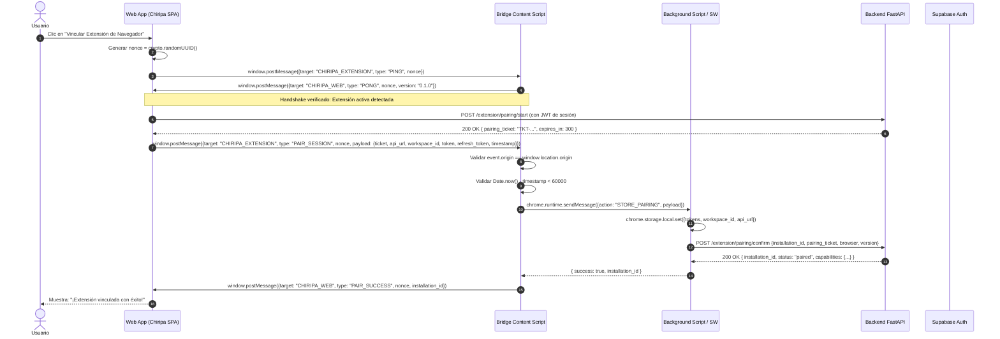
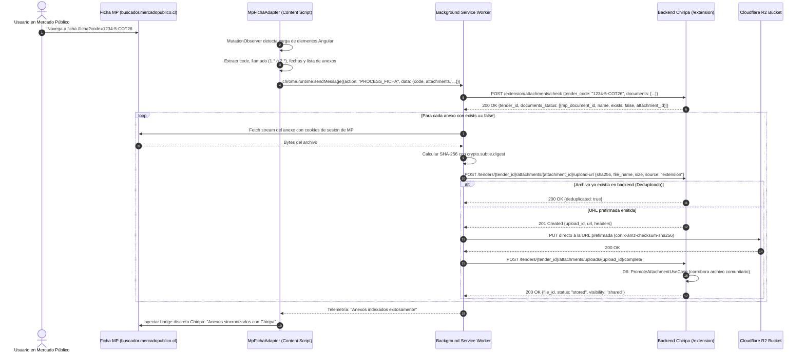
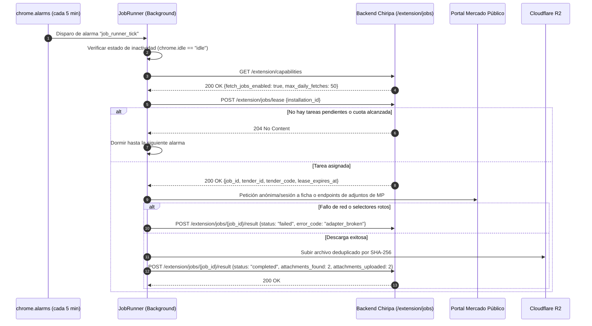

# Decisión 7 del Plan 233: Instrucciones de Implementación

**Tema:** Extensión de navegador para Chrome, Edge y Firefox, lista para postular en el futuro.
**Alcance:** Infraestructura multi-navegador con framework WXT (Manifest V3), emparejamiento seguro web-extensión vía Bridge universal de Content Script (compatible con Gecko y Chromium), adaptador resiliente para la SPA de Mercado Público (`MpFichaAdapter`), descarga y subida deduplicada a Cloudflare R2 por SHA-256 (`by-code`), cola distribuida pull de anexos comunitarios (`LeaseFetchJobsUseCase` + `JobRunner`) con control de velocidad estricto y backoff, y puntos de extensión listos para la postulación futura (HdU 20).

Repositorio `d:\ProyectosYA`.
Backend en `monorepo/backend` (Python 3.12+, FastAPI, SQLModel, Alembic).
Frontend en `monorepo/frontend` (Next.js 16, React 19, TypeScript, TailwindCSS v4, pnpm).
Extensión en `monorepo/extension` (WXT, TypeScript, TailwindCSS v4, React 19, pnpm).

---

## 0. Hechos del código que fijan el diseño

1. **Estado de Alembic y compatibilidad hacia atrás:**
   - La cabeza vigente en el repositorio es `f2c8d4a6b913 (head)` (creada por la Decisión 6: `f2c8d4a6b913_anexos_compartidos_sin_empresa.py`). Si la Decisión 5 (`d8a1c3e5b729_hitos_apuntan_a_archivos_de_anexo.py`) ya fue aplicada, la migración de esta Decisión 7 se encadenará inmediatamente después de la cabeza activa que reporte `alembic heads`.
   - **Regla de oro de migraciones:** Las migraciones corren en el `preDeployCommand` de Railway (`monorepo/backend/railway.toml`). Las tablas nuevas (`extension_installation` y `extension_fetch_job`) no interfieren con la versión en ejecución del backend. Cualquier columna foránea hacia tablas existentes (`users`, `supplier`, `tenders`) debe ser nullable o tener políticas de cascada seguras (`ondelete="CASCADE"` o `"SET NULL"`).
   - En el CI corre `python -m scripts.migraciones` y `alembic check` con `compare_type=True` y `compare_server_default=True`. Toda tabla, índice o restricción debe definirse idéntica en SQLModel y en el script de Alembic.

2. **Estado de endpoints de anexos (`tender_attachments.py`) y almacenamiento R2:**
   - La API ya cuenta con el router `/tenders/{tender_id}/attachments` (`app/infrastructure/routers/tender_attachments.py`), creado en la Decisión 2 y enriquecido en la Decisión 6.
   - Cuenta con el endpoint `POST /{tender_id}/attachments/{attachment_id}/upload-url`, el cual soporta deduplicación: si la empresa ya subió ese archivo o si el hash ya existe, devuelve `200 OK` (`UploadDeduplicatedResponse`) indicando `deduplicated: true`.
   - Si no está duplicado, devuelve `201 Created` (`AttachmentUploadTicketResponse`) con la URL PUT prefirmada directa a Cloudflare R2 (`x-amz-checksum-sha256`), evitando que los bytes pasen por la API o por el proxy de Vercel. En entornos locales sin R2, emite la URL hacia el almacenamiento en disco (`LocalDiskAttachmentStorage`).
   - El endpoint `POST /{tender_id}/attachments/uploads/{upload_id}/complete` verifica la existencia del objeto y su tamaño/hash antes de marcarlo como `stored`.
   - La extensión **no necesita crear un canal de subida paralelo**: reutiliza estos contratos oficiales enviando `source="extension"`.

3. **Modelo de confianza de la Decisión 6 (ADR 0002):**
   - La regla **D6-4** establece: *"La extensión es un canal confiable... Un aporte vía extensión corrobora un aporte manual aunque compartan personas (salvo si es exactamente el mismo autor). Si la extensión respalda una sola versión confirmada o ya compartida, arbitra y desempata."*
   - Una captura aislada de la extensión **no** se comparte automáticamente sola: requiere otra fuente independiente con el mismo SHA-256 o ratificar una versión ya existente.
   - Por tanto, la extensión es la herramienta crítica de la comunidad para corroborar archivos y promoverlos a la versión canónica compartida (`shared/{tender}/{mp_document_id}/{sha256}.{ext}`), beneficiando a todas las MiPymes.

4. **Requisitos de Manifest V3 (MV3) y diferencias críticas entre Chromium y Firefox:**
   - **Service Workers vs. Background Scripts:** En Chromium (Chrome, Edge), MV3 exige `background.service_worker`. Los Service Workers son efímeros y el navegador los suspende tras ~30 segundos de inactividad, lo que destruye cualquier `setInterval` o conexión persistente. Firefox MV3 admite `background.scripts` (event pages). Para lograr ejecución periódica confiable en ambos motores, la extensión debe utilizar la API `chrome.alarms`.
   - **Ausencia de `externally_connectable` en Firefox:** En Chromium es posible declarar `externally_connectable` para que una página web envíe mensajes directos a la extensión con `chrome.runtime.sendMessage(extensionId, ...)`. **Firefox no soporta `externally_connectable` para páginas web estándar**. Depender de esa API rompería Firefox inmediatamente. La solución universal obligatoria es un **Bridge por Content Script** inyectado en el dominio de Chiripa, que se comunica con la SPA web mediante `window.postMessage` validado.
   - **Políticas de publicación en tiendas (Chrome Web Store y Mozilla AMO):** Mozilla prohíbe terminantemente código evaluado dinámicamente (`eval`, `new Function`) y scripts remotos. AMO exige que el código empaquetado sea auditable contra los fuentes del repositorio.

---

## 1. Decisiones de diseño fijadas (D7-1 a D7-12)

| # | Decisión | Justificación técnica |
|---|---|---|
| **D7-1** | **Framework WXT (Web Extension Framework) en `monorepo/extension`:** Se utiliza WXT con TypeScript estricto, React 19 y TailwindCSS v4. Gestor de paquetes obligatorio: `pnpm`. Estructura basada en convenciones bajo `src/entrypoints/`. | WXT compila de forma nativa a Manifest V3 tanto para Chromium (`target: chrome`) como para Firefox (`target: firefox`), unificando APIs polifill (`browser` / `chrome`), resolviendo la disparidad de background service worker vs script, y ofreciendo Vite HMR para desarrollo ágil. |
| **D7-2** | **Emparejamiento seguro web-extensión (Pairing) vía Supabase y `chrome.storage.local`:** La extensión no solicita credenciales de Chiripa al usuario. La web inicia el emparejamiento pasando el token de sesión y el ID de workspace a través del Bridge; la extensión almacena la sesión en `chrome.storage.local` y confirma la instalación ante el backend en `POST /extension/pairing/confirm`. | Elimina la fricción de login duplicado en el popup de la extensión. El almacenamiento en `chrome.storage.local` es privado a la extensión, seguro contra scripts de terceros en páginas web y persiste entre reinicios del navegador. |
| **D7-3** | **Bridge universal por Content Script con origen estricto, nonce criptográfico y ventana temporal:** Para enlazar la web con la extensión en todos los navegadores (Chromium y Firefox), se inyecta un Content Script en los dominios de Chiripa (`chiripa.cl`, `proyectosya.cl`, `localhost:3000`). El protocolo `window.postMessage` exige: (1) `event.origin` idéntico a la ventana actual, (2) canal explícito `target: "CHIRIPA_EXTENSION"`, (3) nonce criptográfico `crypto.randomUUID()`, y (4) marca temporal con caducidad estricta de 60 segundos. | Garantiza compatibilidad al 100% con Firefox sin requerir `externally_connectable`. Previene ataques de suplantación desde iframes o páginas maliciosas mediante validación estricta de origen y previene ataques de repetición con nonce y TTL. |
| **D7-4** | **Feature Flag y Kill Switch centralizado (`EXTENSION_ENABLED` y `GET /extension/capabilities`):** La configuración backend incluye `EXTENSION_ENABLED: bool = True`. El endpoint público/autenticado `GET /extension/capabilities` entrega flags operativos: `mp_adapter_enabled`, `fetch_jobs_enabled`, `min_version`, `max_daily_fetches` y lista de hosts soportados. | Permite desactivar de emergencia el scraper si Mercado Público altera drásticamente su estructura HTML o si surgen incidencias de red, sin esperar los días de revisión y aprobación de las tiendas (Chrome Web Store o Mozilla AMO). |
| **D7-5** | **`MpFichaAdapter`: Scraping resiliente de Mercado Público SPA:** Adaptador especializado para la ficha pública de Compra Ágil (`buscador.mercadopublico.cl/ficha?code=<COT>`). Utiliza `MutationObserver` para aguardar la carga asíncrona del framework Angular, extrae la convocatoria (1.er o 2.º llamado), las fechas de cierre y el listado de documentos adjuntos. Si la estructura cambia, emite telemetría de error `adapter_broken` al backend. | Mercado Público es una Single Page Application (SPA) donde los elementos se inyectan tras peticiones XHR/Fetch. Selectores jerárquicos resilientes con fallback y observadores evitan lecturas de DOM vacío o estados intermedios. |
| **D7-6** | **Reutilización de sesión y cookies del navegador sin credenciales:** La extensión utiliza los permisos de host de `*.mercadopublico.cl` para realizar descargas en el contexto del navegador. No se solicita RUT ni clave de Mercado Público al usuario. Para endpoints que exigen sesión, el navegador envía automáticamente las cookies existentes (`chrome.cookies`). | Cumple con el principio de mínimo privilegio y máxima seguridad: Chiripa nunca almacena ni conoce contraseñas de portales gubernamentales de los usuarios. |
| **D7-7** | **Descarga de anexos y subida deduplicada por SHA-256 (`by-code`):** Al detectar una ficha, la extensión consulta primero `POST /extension/attachments/check` pasando el código de licitación y los nombres/ids de los documentos. Solo descarga los faltantes (`missing`). Calcula el SHA-256 en el navegador con Web Crypto API (`crypto.subtle.digest`), solicita URL prefirmada a la API y sube directo a R2 con `source="extension"`. | Ahorra ancho de banda del usuario y cuota de almacenamiento en Cloudflare R2. Las descargas y subidas son idempotentes y no saturan la conexión del usuario. |
| **D7-8** | **Cola pull de extracción distribuida comunitaria (`LeaseFetchJobsUseCase` + `JobRunner`):** En segundo plano y solo cuando el usuario está inactivo (`chrome.idle`), la extensión solicita periódicamente una tarea a la API (`POST /extension/jobs/lease`). La API asigna una licitación con anexos pendientes mediante `FOR UPDATE SKIP LOCKED` con un arrendamiento (lease) de 5 minutos. Tasa máxima: 1 descarga cada 5 minutos por cliente, con backoff exponencial y jitter aleatorio. | Distribuye el esfuerzo de indexación de anexos entre la comunidad de usuarios de Chiripa sin requerir clusters costosos de navegadores headless (Selenium/Playwright) en servidores de backend. |
| **D7-9** | **Permisos mínimos obligatorios y permisos opcionales diferidos:** Se declaran en el manifiesto únicamente: `storage`, `cookies`, `alarms`, y los hosts de `*.mercadopublico.cl` y de la API/Web de Chiripa. Los permisos de proveedor de Mercado Público para la postulación futura (HdU 20) se configuran como `optional_host_permissions` y **no** se solicitan al instalar. | Minimiza advertencias intimidantes al instalar la extensión en Chrome/Firefox, acelerando la aprobación de las tiendas y generando confianza en los usuarios. |
| **D7-10** | **Empaquetado multi-navegador y validación en CI:** Scripts dedicados `pnpm build:chrome` (`wxt build -b chrome`) y `pnpm build:firefox` (`wxt build -b firefox`). En CI se ejecutan `pnpm exec tsc --noEmit`, Vitest y `pnpm exec web-ext lint` sobre la carpeta de Firefox. | Previene discrepancias de sintaxis de manifiesto entre navegadores y garantiza que el artefacto para Mozilla cumpla con las directrices estrictas de AMO. |
| **D7-11** | **Contratos de API backend para la extensión:** Endpoints formalizados bajo el prefijo `/extension`: capacidades (`/capabilities`), emparejamiento (`/pairing/start`, `/pairing/confirm`), latido (`/installations/heartbeat`), comprobación de anexos (`/attachments/check`), y ciclo de vida de tareas distribuidas (`/jobs/lease`, `/jobs/{job_id}/result`). | Mantiene una separación limpia entre las rutas de la app web y las rutas operativas de extensiones, con versionado y telemetría clara. |
| **D7-12** | **ADR 0003: Arquitectura de la extensión de navegador y adaptador de Mercado Público:** Se documenta la decisión formal en `docs/decisions/0003-arquitectura-extension-navegador.md` y se actualiza el índice en `docs/README.md`. | Consolida la trazabilidad técnica del proyecto y las justificaciones de compatibilidad de navegadores y seguridad. |

---

## 2. Arquitectura y flujos detallados

### 2.1 Flujo de Emparejamiento Web-Extensión (Pairing Handshake)



### 2.2 Flujo de Detección de Ficha en Mercado Público y Subida Deduplicada



### 2.3 Flujo de la Cola Distribuida Pull (Distributed Lease Queue)



---

## 3. Modelos de datos y esquemas

### 3.1 Modelos de Base de Datos (SQLModel / Alembic)

Se agregan dos tablas en PostgreSQL gestionadas exclusivamente por Alembic:

1. `extension_installation`: Registra cada navegador en el que un usuario autenticado instaló y vinculó la extensión.
2. `extension_fetch_job`: Administra la cola de extracción distribuida de anexos para licitaciones cuyos documentos aún no han sido indexados.

#### En `app/domain/entities/extension_installation.py`:

```python
from datetime import datetime
from typing import Literal
from uuid import UUID, uuid4
from pydantic import BaseModel, Field
from app.shared.utils import UtcDateTime, utc_now_naive

BrowserType = Literal["chrome", "firefox", "edge", "safari", "other"]

class ExtensionInstallation(BaseModel):
    id: UUID = Field(default_factory=uuid4)
    user_id: UUID
    workspace_id: UUID | None = None
    browser: BrowserType
    browser_version: str | None = None
    extension_version: str
    is_active: bool = True
    last_heartbeat_at: UtcDateTime | None = None
    created_at: UtcDateTime = Field(default_factory=utc_now_naive)
    updated_at: UtcDateTime = Field(default_factory=utc_now_naive)
```

#### En `app/domain/entities/extension_fetch_job.py`:

```python
from datetime import datetime
from typing import Any, Literal
from uuid import UUID, uuid4
from pydantic import BaseModel, Field
from app.shared.utils import UtcDateTime, utc_now_naive

JobStatus = Literal["pending", "leased", "completed", "failed", "skipped"]

class ExtensionFetchJob(BaseModel):
    id: UUID = Field(default_factory=uuid4)
    tender_id: UUID
    tender_code: str
    status: JobStatus = "pending"
    priority: int = 0
    leased_to_installation_id: UUID | None = None
    leased_at: UtcDateTime | None = None
    lease_expires_at: UtcDateTime | None = None
    attempts: int = 0
    max_attempts: int = 3
    error_code: str | None = None
    error_detail: str | None = None
    result_summary: dict[str, Any] | None = None
    created_at: UtcDateTime = Field(default_factory=utc_now_naive)
    updated_at: UtcDateTime = Field(default_factory=utc_now_naive)
```

#### En `app/infrastructure/repositories/extension_model.py`:

```python
from datetime import datetime
from typing import Any
from uuid import UUID, uuid4
import sqlalchemy as sa
from sqlalchemy.dialects.postgresql import JSONB
from sqlmodel import Field, SQLModel
from app.shared.utils import utc_now_naive

class ExtensionInstallationModel(SQLModel, table=True):
    __tablename__ = "extension_installation"

    id: UUID = Field(default_factory=uuid4, primary_key=True)
    user_id: UUID = Field(
        sa_column=sa.Column(
            sa.Uuid(),
            sa.ForeignKey("users.id", ondelete="CASCADE"),
            nullable=False,
            index=True,
        )
    )
    workspace_id: UUID | None = Field(
        default=None,
        sa_column=sa.Column(
            sa.Uuid(),
            sa.ForeignKey("supplier.id", ondelete="SET NULL"),
            nullable=True,
            index=True,
        ),
    )
    browser: str = Field(sa_column=sa.Column(sa.String(32), nullable=False))
    browser_version: str | None = Field(default=None, sa_column=sa.Column(sa.String(64), nullable=True))
    extension_version: str = Field(sa_column=sa.Column(sa.String(32), nullable=False))
    is_active: bool = Field(default=True, sa_column=sa.Column(sa.Boolean(), nullable=False, index=True))
    last_heartbeat_at: datetime | None = Field(default=None, sa_column=sa.Column(sa.DateTime(), nullable=True))
    created_at: datetime = Field(
        default_factory=utc_now_naive,
        sa_column=sa.Column(sa.DateTime(), nullable=False),
    )
    updated_at: datetime = Field(
        default_factory=utc_now_naive,
        sa_column=sa.Column(sa.DateTime(), nullable=False),
    )


class ExtensionFetchJobModel(SQLModel, table=True):
    __tablename__ = "extension_fetch_job"

    id: UUID = Field(default_factory=uuid4, primary_key=True)
    tender_id: UUID = Field(
        sa_column=sa.Column(
            sa.Uuid(),
            sa.ForeignKey("tenders.id", ondelete="CASCADE"),
            nullable=False,
            index=True,
        )
    )
    tender_code: str = Field(sa_column=sa.Column(sa.String(64), nullable=False, index=True))
    status: str = Field(
        default="pending",
        sa_column=sa.Column(sa.String(32), nullable=False, index=True),
    )
    priority: int = Field(default=0, sa_column=sa.Column(sa.Integer(), nullable=False, index=True))
    leased_to_installation_id: UUID | None = Field(
        default=None,
        sa_column=sa.Column(
            sa.Uuid(),
            sa.ForeignKey("extension_installation.id", ondelete="SET NULL"),
            nullable=True,
            index=True,
        ),
    )
    leased_at: datetime | None = Field(default=None, sa_column=sa.Column(sa.DateTime(), nullable=True))
    lease_expires_at: datetime | None = Field(
        default=None,
        sa_column=sa.Column(sa.DateTime(), nullable=True, index=True),
    )
    attempts: int = Field(default=0, sa_column=sa.Column(sa.Integer(), nullable=False))
    max_attempts: int = Field(default=3, sa_column=sa.Column(sa.Integer(), nullable=False))
    error_code: str | None = Field(default=None, sa_column=sa.Column(sa.String(64), nullable=True))
    error_detail: str | None = Field(default=None, sa_column=sa.Column(sa.Text(), nullable=True))
    result_summary: dict[str, Any] | None = Field(
        default=None,
        sa_column=sa.Column(JSONB, nullable=True),
    )
    created_at: datetime = Field(
        default_factory=utc_now_naive,
        sa_column=sa.Column(sa.DateTime(), nullable=False),
    )
    updated_at: datetime = Field(
        default_factory=utc_now_naive,
        sa_column=sa.Column(sa.DateTime(), nullable=False),
    )

    __table_args__ = (
        sa.Index(
            "ix_extension_fetch_job_queue",
            "status",
            sa.text("priority DESC"),
            "lease_expires_at",
            "created_at",
        ),
        sa.Index(
            "uq_extension_fetch_job_active_tender",
            "tender_id",
            unique=True,
            postgresql_where=sa.text("status IN ('pending', 'leased')"),
        ),
    )
```

#### Migración de Alembic: `alembic/versions/e3d9b1c7a842_extension_instalaciones_y_trabajos.py`

```python
"""extension_instalaciones_y_trabajos

Revision ID: e3d9b1c7a842
Revises: f2c8d4a6b913
Create Date: 2026-10-04 12:00:00.000000

Plan 233, decisión 7. Tablas para registro de instalaciones de extensión
y cola de extracción distribuida con bloqueo skip locked.
"""
from collections.abc import Sequence
import sqlalchemy as sa
from sqlalchemy.dialects import postgresql
from alembic import op

revision: str = "e3d9b1c7a842"
down_revision: str | Sequence[str] | None = "f2c8d4a6b913"
branch_labels: str | Sequence[str] | None = None
depends_on: str | Sequence[str] | None = None

def upgrade() -> None:
    op.create_table(
        "extension_installation",
        sa.Column("id", sa.Uuid(), nullable=False),
        sa.Column("user_id", sa.Uuid(), nullable=False),
        sa.Column("workspace_id", sa.Uuid(), nullable=True),
        sa.Column("browser", sa.String(length=32), nullable=False),
        sa.Column("browser_version", sa.String(length=64), nullable=True),
        sa.Column("extension_version", sa.String(length=32), nullable=False),
        sa.Column("is_active", sa.Boolean(), nullable=False, server_default=sa.text("true")),
        sa.Column("last_heartbeat_at", sa.DateTime(), nullable=True),
        sa.Column("created_at", sa.DateTime(), nullable=False, server_default=sa.func.now()),
        sa.Column("updated_at", sa.DateTime(), nullable=False, server_default=sa.func.now()),
        sa.ForeignKeyConstraint(["user_id"], ["users.id"], ondelete="CASCADE"),
        sa.ForeignKeyConstraint(["workspace_id"], ["supplier.id"], ondelete="SET NULL"),
        sa.PrimaryKeyConstraint("id"),
    )
    op.create_index("ix_extension_installation_user_id", "extension_installation", ["user_id"])
    op.create_index("ix_extension_installation_workspace_id", "extension_installation", ["workspace_id"])
    op.create_index("ix_extension_installation_is_active", "extension_installation", ["is_active"])

    op.create_table(
        "extension_fetch_job",
        sa.Column("id", sa.Uuid(), nullable=False),
        sa.Column("tender_id", sa.Uuid(), nullable=False),
        sa.Column("tender_code", sa.String(length=64), nullable=False),
        sa.Column("status", sa.String(length=32), nullable=False, server_default=sa.text("'pending'")),
        sa.Column("priority", sa.Integer(), nullable=False, server_default=sa.text("0")),
        sa.Column("leased_to_installation_id", sa.Uuid(), nullable=True),
        sa.Column("leased_at", sa.DateTime(), nullable=True),
        sa.Column("lease_expires_at", sa.DateTime(), nullable=True),
        sa.Column("attempts", sa.Integer(), nullable=False, server_default=sa.text("0")),
        sa.Column("max_attempts", sa.Integer(), nullable=False, server_default=sa.text("3")),
        sa.Column("error_code", sa.String(length=64), nullable=True),
        sa.Column("error_detail", sa.Text(), nullable=True),
        sa.Column("result_summary", postgresql.JSONB(astext_type=sa.Text()), nullable=True),
        sa.Column("created_at", sa.DateTime(), nullable=False, server_default=sa.func.now()),
        sa.Column("updated_at", sa.DateTime(), nullable=False, server_default=sa.func.now()),
        sa.ForeignKeyConstraint(["tender_id"], ["tenders.id"], ondelete="CASCADE"),
        sa.ForeignKeyConstraint(["leased_to_installation_id"], ["extension_installation.id"], ondelete="SET NULL"),
        sa.PrimaryKeyConstraint("id"),
    )
    op.create_index("ix_extension_fetch_job_tender_id", "extension_fetch_job", ["tender_id"])
    op.create_index("ix_extension_fetch_job_tender_code", "extension_fetch_job", ["tender_code"])
    op.create_index("ix_extension_fetch_job_status", "extension_fetch_job", ["status"])
    op.create_index("ix_extension_fetch_job_priority", "extension_fetch_job", ["priority"])
    op.create_index("ix_extension_fetch_job_lease_expires_at", "extension_fetch_job", ["lease_expires_at"])
    op.create_index(
        "ix_extension_fetch_job_queue",
        "extension_fetch_job",
        ["status", sa.text("priority DESC"), "lease_expires_at", "created_at"],
    )
    op.create_index(
        "uq_extension_fetch_job_active_tender",
        "extension_fetch_job",
        ["tender_id"],
        unique=True,
        postgresql_where=sa.text("status IN ('pending', 'leased')"),
    )

def downgrade() -> None:
    op.drop_index("uq_extension_fetch_job_active_tender", table_name="extension_fetch_job")
    op.drop_index("ix_extension_fetch_job_queue", table_name="extension_fetch_job")
    op.drop_table("extension_fetch_job")
    op.drop_table("extension_installation")
```

---

### 3.2 Schemas de API Backend (`app/application/schemas/extension_schema.py`)

```python
from datetime import datetime
from typing import Any, Literal
from uuid import UUID
from pydantic import BaseModel, Field

class ExtensionCapabilitiesResponse(BaseModel):
    enabled: bool
    min_version: str = "0.1.0"
    latest_version: str = "0.1.0"
    mp_adapter_enabled: bool = True
    fetch_jobs_enabled: bool = True
    postulation_enabled: bool = False
    max_daily_fetches: int = 50
    polling_interval_seconds: int = 300
    supported_mp_hosts: list[str] = Field(
        default_factory=lambda: [
            "buscador.mercadopublico.cl",
            "adjunto.mercadopublico.cl",
        ]
    )
    message: str | None = None

class ExtensionPairingStartRequest(BaseModel):
    browser: Literal["chrome", "firefox", "edge", "safari", "other"]
    extension_version: str

class ExtensionPairingStartResponse(BaseModel):
    pairing_ticket: str
    expires_in_seconds: int = 300

class ExtensionPairingConfirmRequest(BaseModel):
    pairing_ticket: str
    installation_id: UUID
    browser: Literal["chrome", "firefox", "edge", "safari", "other"]
    browser_version: str | None = None
    extension_version: str

class ExtensionPairingConfirmResponse(BaseModel):
    installation_id: UUID
    status: Literal["paired", "updated"]
    workspace_id: UUID | None
    capabilities: ExtensionCapabilitiesResponse

class ExtensionHeartbeatRequest(BaseModel):
    installation_id: UUID
    extension_version: str

class ExtensionHeartbeatResponse(BaseModel):
    acknowledged: bool
    capabilities: ExtensionCapabilitiesResponse

class DocumentCheckItem(BaseModel):
    mp_document_id: str
    name: str

class ExtensionAttachmentCheckRequest(BaseModel):
    tender_code: str
    documents: list[DocumentCheckItem]

class DocumentCheckStatus(BaseModel):
    mp_document_id: str
    name: str
    attachment_id: UUID | None
    status: Literal["missing", "uploading", "stored", "rejected", "unsupported"]
    exists: bool

class ExtensionAttachmentCheckResponse(BaseModel):
    tender_id: UUID | None
    tender_code: str
    documents: list[DocumentCheckStatus]

class ExtensionJobLeaseRequest(BaseModel):
    installation_id: UUID

class ExtensionJobLeaseResponse(BaseModel):
    job_id: UUID
    tender_id: UUID
    tender_code: str
    lease_expires_at: datetime

class ExtensionJobResultRequest(BaseModel):
    installation_id: UUID
    status: Literal["completed", "failed", "skipped"]
    error_code: str | None = None
    error_detail: str | None = None
    result_summary: dict[str, Any] | None = None
```

---

### 3.3 Schemas y Tipos de la Extensión (`monorepo/extension/src/types/schemas.ts`)

```typescript
import { z } from "zod";

export const CapabilitiesSchema = z.object({
  enabled: z.boolean(),
  min_version: z.string(),
  latest_version: z.string(),
  mp_adapter_enabled: z.boolean(),
  fetch_jobs_enabled: z.boolean(),
  postulation_enabled: z.boolean(),
  max_daily_fetches: z.number(),
  polling_interval_seconds: z.number(),
  supported_mp_hosts: z.array(z.string()),
  message: z.string().nullable(),
});
export type Capabilities = z.infer<typeof CapabilitiesSchema>;

export const BridgePairingMessageSchema = z.object({
  target: z.literal("CHIRIPA_EXTENSION"),
  type: z.literal("PAIR_SESSION"),
  nonce: z.string().uuid(),
  payload: z.object({
    pairing_ticket: z.string(),
    api_url: z.string().url(),
    supabase_url: z.string().url(),
    workspace_id: z.string().uuid().nullable(),
    access_token: z.string(),
    refresh_token: z.string(),
    timestamp: z.number(),
  }),
});
export type BridgePairingMessage = z.infer<typeof BridgePairingMessageSchema>;

export const MpDocumentItemSchema = z.object({
  mp_document_id: z.string(),
  name: z.string(),
  size_bytes: z.number().optional(),
  download_url: z.string().optional(),
});
export type MpDocumentItem = z.infer<typeof MpDocumentItemSchema>;

export const MpFichaDataSchema = z.object({
  tender_code: z.string(),
  call_number: z.union([z.literal(1), z.literal(2)]),
  first_call_closing_at: z.string().nullable(),
  second_call_closing_at: z.string().nullable(),
  documents: z.array(MpDocumentItemSchema),
});
export type MpFichaData = z.infer<typeof MpFichaDataSchema>;
```

---

## 4. Backend: Desglose TDD paso a paso

### Paso 1: Entidades, DTOs y Validación

**Tests primero: `tests/unit/domain/test_extension_entities.py`**
- `test_crear_extension_installation_valida`: Valida la instanciación con `browser="chrome"`, version y UUIDs válidos.
- `test_crear_extension_fetch_job_por_defecto`: Verifica `status="pending"`, `attempts=0`, `priority=0`.
- `test_schemas_pairing_y_check`: Asegura que `ExtensionAttachmentCheckRequest` y respuestas serialicen correctamente.

**Implementación:**
- Crear `app/domain/entities/extension_installation.py`.
- Crear `app/domain/entities/extension_fetch_job.py`.
- Crear `app/application/schemas/extension_schema.py`.

### Paso 2: Repositorios de Persistencia SQL

**Tests primero: `tests/integration/test_sql_extension_repositories.py`**
- `test_registrar_o_actualizar_instalacion`: Guarda y recupera una instalación; actualiza `last_heartbeat_at`.
- `test_arrendar_trabajo_skip_locked`: Crea 2 tareas; dos llamadas concurrentes a `lease_next_job` reciben tareas distintas sin colisión.
- `test_completar_trabajo_actualiza_estado`: `complete_job` pasa el estado a `completed` y almacena `result_summary`.

**Implementación:**
- Crear `app/application/repositories/extension_repository.py` (`IExtensionInstallationRepository`, `IExtensionFetchJobRepository`).
- Crear `app/infrastructure/repositories/extension_model.py`.
- Crear `app/infrastructure/repositories/sql_extension_repository.py`.
- Crear migración `alembic/versions/e3d9b1c7a842_extension_instalaciones_y_trabajos.py`.

### Paso 3: Casos de Uso del Backend

**Tests primero: `tests/unit/application/test_extension_use_cases.py`**
- `test_capabilities_respeta_flag_extension_enabled`: Con `settings.extension_enabled = False`, retorna `enabled=False`.
- `test_confirmar_pairing_asocia_workspace`: Valida el ticket efímero y registra la instalación.
- `test_check_attachments_detecta_guardados`: Cruza con `tender_attachment` y `attachment_file`: documentos ya en `stored` retornan `exists=True`.
- `test_lease_jobs_respeta_cuota_diaria`: Si la instalación superó 50 tareas en las últimas 24h, retorna `None`.

**Implementación:**
- `app/application/use_cases/extension/get_extension_capabilities.py`
- `app/application/use_cases/extension/pair_extension.py`
- `app/application/use_cases/extension/check_extension_attachments.py`
- `app/application/use_cases/extension/lease_fetch_jobs.py`
- `app/application/use_cases/extension/report_job_result.py`

### Paso 4: Router FastAPI y Wiring en Bootstrap

**Tests primero: `tests/unit/infrastructure/test_extension_router.py`**
- `test_get_capabilities_publico`: Responde 200 sin exigir cabecera de autenticación.
- `test_pairing_confirm_exige_ticket_valido`: Devuelve 400/404 si el ticket no existe o expiró.
- `test_jobs_lease_retorna_204_si_vacio`: Sin tareas en cola, devuelve `204 No Content`.

**Implementación:**
- Crear `app/infrastructure/routers/extension.py` con la fábrica `create_extension_router(...)`. Documentar con `summary`, `response_model`, `tags=["Extension"]`.
- Conectar dependencias en `app/bootstrap.py`.
- Registrar router en `app/main.py`.

---

## 5. Extensión: Desglose TDD paso a paso

### Paso 5: Scaffold de WXT y Configuración

Estructura de `monorepo/extension`:
```text
monorepo/extension/
├── package.json
├── tsconfig.json
├── wxt.config.ts
├── src/
│   ├── entrypoints/
│   │   ├── background.ts
│   │   ├── bridge.content.ts
│   │   ├── mp.content.ts
│   │   └── popup/
│   │       ├── index.html
│   │       ├── main.tsx
│   │       └── App.tsx
│   ├── adapters/
│   │   └── mp/
│   │       ├── mp-ficha-adapter.ts
│   │       └── __tests__/mp-ficha-adapter.test.ts
│   ├── services/
│   │   ├── bridge/
│   │   │   ├── content-script-bridge.ts
│   │   │   └── __tests__/bridge.test.ts
│   │   ├── storage/
│   │   │   └── extension-storage.ts
│   │   ├── uploader/
│   │   │   ├── r2-uploader.ts
│   │   │   └── __tests__/r2-uploader.test.ts
│   │   └── jobs/
│   │       ├── job-runner.ts
│   │       └── __tests__/job-runner.test.ts
│   └── types/
│       └── schemas.ts
```

#### `package.json` (`monorepo/extension/package.json`):

```json
{
  "name": "@chiripa/extension",
  "version": "0.1.0",
  "private": true,
  "type": "module",
  "scripts": {
    "dev": "wxt",
    "dev:firefox": "wxt -b firefox",
    "build": "wxt build",
    "build:chrome": "wxt build -b chrome",
    "build:firefox": "wxt build -b firefox",
    "compile": "tsc --noEmit",
    "test": "vitest run",
    "test:watch": "vitest",
    "web-ext:lint": "web-ext lint --source-dir .output/firefox-mv3"
  },
  "dependencies": {
    "@supabase/supabase-js": "^2.48.0",
    "lucide-react": "^0.475.0",
    "react": "^19.0.0",
    "react-dom": "^19.0.0",
    "zod": "^3.24.1"
  },
  "devDependencies": {
    "@types/chrome": "^0.0.300",
    "@types/react": "^19.0.8",
    "@types/react-dom": "^19.0.3",
    "@vitejs/plugin-react": "^4.3.4",
    "tailwindcss": "^4.0.0",
    "typescript": "^5.7.3",
    "vitest": "^3.0.4",
    "web-ext": "^8.4.0",
    "wxt": "^0.19.26"
  }
}
```

#### `wxt.config.ts`:

```typescript
import { defineConfig } from "wxt";

export default defineConfig({
  srcDir: "src",
  manifest: ({ browser }) => ({
    name: "Chiripa — Licitaciones Inteligentes",
    description: "Sincroniza bases oficiales y anexos de Mercado Público para MiPymes.",
    version: "0.1.0",
    permissions: ["storage", "cookies", "alarms"],
    host_permissions: [
      "*://*.mercadopublico.cl/*",
      "*://*.chiripa.cl/*",
      "*://*.proyectosya.cl/*",
      "http://localhost:3000/*",
      "http://localhost:8000/*",
    ],
    optional_host_permissions: [
      "*://mercadopublico.cl/Portal/Modules/Site/Buyer/*",
      "*://proveedor.mercadopublico.cl/*",
    ],
    icons: {
      "16": "icons/icon-16.png",
      "48": "icons/icon-48.png",
      "128": "icons/icon-128.png",
    },
    action: {
      default_title: "Chiripa Licitaciones",
      default_popup: "popup/index.html",
    },
  }),
});
```

---

### Paso 6: Bridge Content Script y Handshake de Emparejamiento

**Tests primero: `src/services/bridge/__tests__/bridge.test.ts`**
- `test_rechaza_origen_desconocido`: Simula `postMessage` desde `https://malicious-site.com`; el bridge descarta el evento.
- `test_rechaza_mensaje_expirado`: Mensaje con `timestamp` mayor a 60 segundos es ignorado.
- `test_acepta_y_reenvia_pairing_valido`: Mensaje con origen válido, nonce y payload reenvía a `chrome.runtime.sendMessage`.

**Implementación (`src/entrypoints/bridge.content.ts`):**

```typescript
import { defineContentScript } from "wxt/sandbox";
import { BridgePairingMessageSchema } from "../types/schemas";

export default defineContentScript({
  matches: [
    "*://*.chiripa.cl/*",
    "*://*.proyectosya.cl/*",
    "http://localhost:3000/*",
  ],
  runAt: "document_idle",
  main() {
    window.addEventListener("message", async (event) => {
      // 1. Origen estricto: debe coincidir exactamente con la ventana actual
      if (event.origin !== window.location.origin) return;

      const data = event.data;
      if (!data || data.target !== "CHIRIPA_EXTENSION") return;

      if (data.type === "PING") {
        window.postMessage(
          {
            target: "CHIRIPA_WEB",
            type: "PONG",
            nonce: data.nonce,
            version: "0.1.0",
          },
          window.location.origin
        );
        return;
      }

      if (data.type === "PAIR_SESSION") {
        const parsed = BridgePairingMessageSchema.safeParse(data);
        if (!parsed.success) return;

        // 2. Ventana temporal estricta de 60 segundos
        const now = Date.now();
        if (Math.abs(now - parsed.data.payload.timestamp) > 60_000) {
          console.warn("[Chiripa Extension] Mensaje de pairing expirado");
          return;
        }

        // 3. Reenvío al Background Service Worker
        chrome.runtime.sendMessage(
          { action: "STORE_PAIRING", payload: parsed.data.payload },
          (response) => {
            if (response?.success) {
              window.postMessage(
                {
                  target: "CHIRIPA_WEB",
                  type: "PAIR_SUCCESS",
                  nonce: parsed.data.nonce,
                  installation_id: response.installation_id,
                },
                window.location.origin
              );
            }
          }
        );
      }
    });
  },
});
```

---

### Paso 7: `MpFichaAdapter` (Scraping Resiliente de Mercado Público)

**Tests primero: `src/adapters/mp/__tests__/mp-ficha-adapter.test.ts`**
- `test_extrae_primer_llamado`: Con fixture HTML de Compra Ágil (1.er llamado), extrae `call_number: 1`, fecha y tabla de anexos.
- `test_extrae_segundo_llamado`: Con fixture de 2.º llamado, extrae `call_number: 2` y ambas fechas.
- `test_emite_adapter_broken_si_estructura_falta`: Con HTML corrupto sin selectores, lanza o reporta `adapter_broken`.

**Implementación (`src/adapters/mp/mp-ficha-adapter.ts`):**

```typescript
import { MpDocumentItem, MpFichaData } from "../../types/schemas";

export class MpFichaAdapter {
  private document: Document;

  constructor(doc: Document = window.document) {
    this.document = doc;
  }

  public extractCode(): string | null {
    // 1. Desde URL query parameter ?code=
    const params = new URLSearchParams(window.location.search);
    const codeParam = params.get("code");
    if (codeParam) return codeParam.trim();

    // 2. Fallback a encabezados de la ficha
    const codeEl = this.document.querySelector('[data-testid="tender-code"], .codigo-licitacion, h1, h2');
    if (codeEl?.textContent) {
      const match = codeEl.textContent.match(/\d+-\d+-(?:COT|L1|LE|LP)\d+/i);
      if (match) return match[0].toUpperCase();
    }
    return null;
  }

  public extractCallInfo(): { call_number: 1 | 2; first_call?: string | null; second_call?: string | null } {
    const bodyText = this.document.body.innerText || "";
    const isSecondCall = /segundo\s+llamado|2[°º.]?\s*llamado/i.test(bodyText);

    return {
      call_number: isSecondCall ? 2 : 1,
      first_call: this.extractDateByLabel(["Cierre primer llamado", "Fecha de cierre"]),
      second_call: isSecondCall ? this.extractDateByLabel(["Cierre segundo llamado", "Nuevo cierre"]) : null,
    };
  }

  public extractAttachments(): MpDocumentItem[] {
    const documents: MpDocumentItem[] = [];
    // Selectores resilientes para tablas y acordeones de Mercado Público SPA
    const rows = this.document.querySelectorAll(
      'table[data-section="adjuntos"] tbody tr, .tabla-adjuntos tbody tr, tr[ng-repeat*="adjunto"], tr.attachment-row'
    );

    rows.forEach((row, idx) => {
      const nameEl = row.querySelector('.nombre-archivo, td[data-col="nombre"], a.download-link, td:nth-child(1)');
      const name = nameEl?.textContent?.trim();
      if (!name) return;

      const idAttr = row.getAttribute("data-id") || row.querySelector("[data-doc-id]")?.getAttribute("data-doc-id");
      const mp_document_id = idAttr || `mp-doc-${idx + 1}`;

      documents.push({
        mp_document_id,
        name,
      });
    });

    return documents;
  }

  private extractDateByLabel(labels: string[]): string | null {
    for (const label of labels) {
      const regex = new RegExp(`${label}[:\\s]+([0-9]{2}[/-][0-9]{2}[/-][0-9]{4}(?:\\s+[0-9]{2}:[0-9]{2})?)`, "i");
      const match = this.document.body.innerText.match(regex);
      if (match) return match[1];
    }
    return null;
  }

  public async waitForHydration(timeoutMs: number = 10000): Promise<boolean> {
    const startTime = Date.now();
    return new Promise((resolve) => {
      const check = () => {
        if (this.extractCode() && (this.extractAttachments().length > 0 || this.document.querySelector(".sin-adjuntos"))) {
          resolve(true);
          return;
        }
        if (Date.now() - startTime > timeoutMs) {
          resolve(false);
          return;
        }
        setTimeout(check, 500);
      };
      check();
    });
  }
}
```

---

### Paso 8: Cálculo de SHA-256 en Cliente y Subida con `R2Uploader`

**Tests primero: `src/services/uploader/__tests__/r2-uploader.test.ts`**
- `test_calculo_sha256_exacto`: Calcula SHA-256 de un ArrayBuffer (`"test content"`) coincidente con `echo -n "test content" | sha256sum`.
- `test_subida_directa_r2_con_headers`: Mockea `fetch` a la URL firmada asegurando envío de `headers` devueltos por el backend y `x-amz-checksum-sha256`.

**Implementación (`src/services/uploader/r2-uploader.ts`):**

```typescript
export class R2Uploader {
  public static async calculateSha256(data: ArrayBuffer): Promise<string> {
    const hashBuffer = await crypto.subtle.digest("SHA-256", data);
    const hashArray = Array.from(new Uint8Array(hashBuffer));
    return hashArray.map((b) => b.toString(16).padStart(2, "0")).join("");
  }

  public static async uploadToR2(
    putUrl: string,
    fileBytes: ArrayBuffer,
    headers: Record<string, string>
  ): Promise<void> {
    const response = await fetch(putUrl, {
      method: "PUT",
      headers: {
        ...headers,
        "Content-Type": headers["Content-Type"] || "application/octet-stream",
      },
      body: fileBytes,
    });

    if (!response.ok) {
      throw new Error(`Error en subida directa a R2: ${response.status} ${response.statusText}`);
    }
  }
}
```

---

### Paso 9: `JobRunner` Distribuido en Background

**Implementación (`src/services/jobs/job-runner.ts`):**

```typescript
import { Capabilities } from "../../types/schemas";

export class JobRunner {
  private isRunning: boolean = false;

  public async runCycle(capabilities: Capabilities): Promise<void> {
    if (!capabilities.fetch_jobs_enabled || this.isRunning) return;

    // Verificar inactividad para no entorpecer al usuario
    const state = await this.getIdleState(120);
    if (state !== "idle") {
      return;
    }

    this.isRunning = true;
    try {
      const job = await this.leaseJob();
      if (!job) return;

      // Descargar ficha en segundo plano, extraer anexos y subir
      await this.processJob(job);
    } catch (err) {
      console.error("[JobRunner] Error en ciclo distribuido:", err);
    } finally {
      this.isRunning = false;
    }
  }

  private async getIdleState(thresholdSeconds: number): Promise<chrome.idle.IdleState> {
    return new Promise((resolve) => {
      chrome.idle.queryState(thresholdSeconds, resolve);
    });
  }

  private async leaseJob(): Promise<any | null> {
    const creds = await chrome.storage.local.get(["chiripa_api_url", "chiripa_access_token", "chiripa_installation_id"]);
    if (!creds.chiripa_api_url || !creds.chiripa_access_token) return null;

    const res = await fetch(`${creds.chiripa_api_url}/extension/jobs/lease`, {
      method: "POST",
      headers: {
        "Content-Type": "application/json",
        Authorization: `Bearer ${creds.chiripa_access_token}`,
      },
      body: JSON.stringify({ installation_id: creds.chiripa_installation_id }),
    });

    if (res.status === 204 || !res.ok) return null;
    return await res.json();
  }

  private async processJob(job: any): Promise<void> {
    // Procesa y reporta resultado a /extension/jobs/{job_id}/result
  }
}
```

---

### Paso 10: Pruebas E2E de Playwright con Extensión sin Empaquetar

**En `tests/e2e/extension/extension_mock_ficha.spec.ts`:**
- Configura Chromium con `--disable-extensions-except=./monorepo/extension/.output/chrome-mv3 --load-extension=./monorepo/extension/.output/chrome-mv3`.
- Levanta un servidor HTTP local que sirve una ficha mock de Mercado Público (`http://localhost:8080/ficha?code=2345-6-COT26`).
- Navega con Playwright a la ficha mock.
- Verifica que el content script detecta el código y los anexos sin errores de consola.
- Verifica que el badge de Chiripa se inyecta en el DOM indicando estado de sincronización.

---

## 6. Trampas conocidas y cómo evitarlas

1. **Firefox no soporta `externally_connectable` con páginas web:**
   - *Trampa:* Intentar comunicar la SPA de Next.js con la extensión llamando directamente a `chrome.runtime.sendMessage(extensionId, ...)` causa un fallo fatal en Firefox (`TypeError: chrome.runtime.sendMessage is not a function` o rechazo de manifiesto).
   - *Solución:* Mantener estrictamente el patrón D7-3 (Bridge por Content Script inyectado en la web que intercambia mensajes vía `window.postMessage`).

2. **Muerte silenciosa del Service Worker en Chrome MV3:**
   - *Trampa:* Usar `setInterval(pollJobs, 300000)` en `background.ts`. A los 30 segundos de inactividad, Chrome destruye el service worker y el timer nunca vuelve a dispararse.
   - *Solución:* Usar exclusivamente la API `chrome.alarms.create("job_tick", { periodInMinutes: 5 })` y escuchar en `chrome.alarms.onAlarm`.

3. **CORS en subidas directas a Cloudflare R2:**
   - *Trampa:* La extensión ejecuta `fetch(putUrl, { method: "PUT", body })` desde el contexto del background service worker o del content script. Si el bucket R2 no tiene configurado `AllowedOrigins: ["*"]` o `AllowedHeaders: ["*"]`, la subida falla con `CORS error`.
   - *Solución:* En el bucket de R2 configurar la regla CORS permitiendo `PUT` y `HEAD` con cabeceras `x-amz-checksum-sha256` y `Content-Type`. En desarrollo local sin R2, el proxy dev de FastAPI ya incluye `CORSMiddleware`.

4. **Mercado Público SPA y enrutamiento interno de Angular:**
   - *Trampa:* El usuario navega entre fichas sin recargar la página (`history.pushState`). Un content script que solo corre en `onload` no detecta la nueva ficha.
   - *Solución:* El adaptador observa cambios en `location.href` interceptando `popstate` y empleando `MutationObserver` sobre el contenedor principal (`#ficha-container`, `app-root`).

5. **Colisiones y carreras en la cola distribuida (Distributed Queue):**
   - *Trampa:* Dos extensiones que consultan simultáneamente `/extension/jobs/lease` reciben la misma licitación, descargándola dos veces y saturando la red.
   - *Solución:* En PostgreSQL utilizar `SELECT ... FOR UPDATE SKIP LOCKED` al asignar el trabajo, y contar con el índice único parcial `uq_extension_fetch_job_active_tender` sobre `(tender_id) WHERE status IN ('pending', 'leased')`.

6. **Sobrecarga o bloqueo por parte de Mercado Público (Politeness):**
   - *Trampa:* Lanzar descargas masivas concurrentes desde la IP del usuario, provocando respuestas `429 Too Many Requests` o bloqueos temporales de IP.
   - *Solución:* Rate-limiting estricto: máximo 1 descarga cada 5 minutos por cliente en segundo plano, jitter aleatorio de 30 a 90 segundos, detención inmediata si la respuesta contiene código 429 o bloqueo, y respetar el kill switch centralizado (`GET /extension/capabilities`).

---

## 7. Comandos de verificación y Checklist de salida

### Comandos de ejecución

```bash
# 1. Backend (monorepo/backend, .venv activo)
pytest tests/unit/domain/test_extension_entities.py
pytest tests/unit/application/test_extension_use_cases.py
pytest tests/unit/infrastructure/test_extension_router.py
pytest tests/integration/test_sql_extension_repositories.py
python -m scripts.migraciones
alembic heads
ruff check .

# 2. Extensión (monorepo/extension)
pnpm run test
pnpm exec tsc --noEmit
pnpm run build:chrome
pnpm run build:firefox
pnpm run web-ext:lint

# 3. Frontend (monorepo/frontend)
pnpm run test
pnpm exec tsc --noEmit
```

### Checklist de salida (Definición de Terminado)

- [ ] Las tablas `extension_installation` y `extension_fetch_job` están versionadas con Alembic y enlazan limpiamente con la cabeza activa.
- [ ] `GET /extension/capabilities` responde correctamente con el estado del feature flag `EXTENSION_ENABLED`.
- [ ] El handshake de emparejamiento web-extensión valida origen estricto, nonce y ventana temporal de 60 segundos, funcionando tanto en Chromium como en Firefox.
- [ ] `MpFichaAdapter` extrae de manera fiable código, convocatoria (1.er o 2.º llamado) y listado de anexos sobre fixtures reales saneados.
- [ ] La descarga en cliente calcula SHA-256 mediante Web Crypto y sube directamente a R2 evitando duplicados (`by-code`).
- [ ] Los aportes subidos por la extensión registran `source="extension"` e interactúan correctamente con el algoritmo de confianza de la Decisión 6 (ADR 0002).
- [ ] La cola distribuida `LeaseFetchJobsUseCase` utiliza `FOR UPDATE SKIP LOCKED` y respeta el límite diario de tareas y estado de inactividad del usuario.
- [ ] El empaquetado genera artefactos limpios para Chrome (`.output/chrome-mv3`) y Firefox (`.output/firefox-mv3`), pasando `web-ext lint` sin advertencias críticas.
- [ ] ADR 0003 está redactado y registrado en `docs/decisions/0003-arquitectura-extension-navegador.md`.
