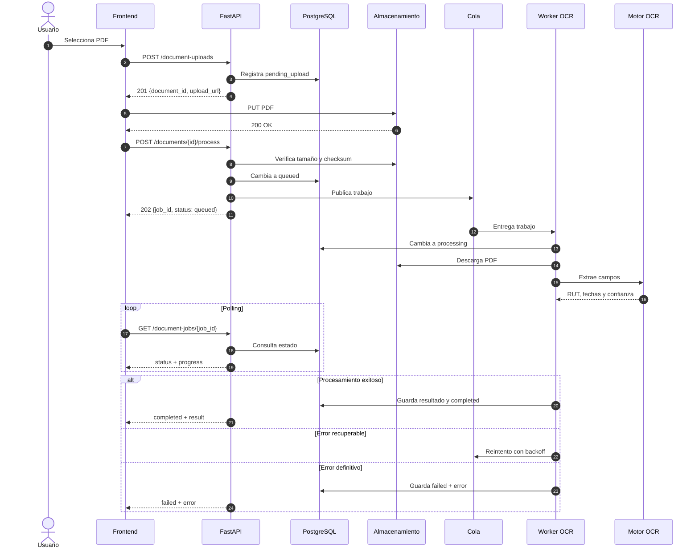

# SPIKE 1.3 — Arquitectura y testing de PDFs pesados

## Decisión de arquitectura

La carga y el procesamiento son operaciones separadas. El frontend obtiene una
URL de carga, envía el PDF y luego solicita el procesamiento. La API responde
`202 Accepted` sin esperar el OCR. El estado se consulta mediante polling.

En producción, la URL de carga apuntará a almacenamiento de objetos y el
procesamiento se delegará a una cola y workers. El mock mantiene el mismo
contrato HTTP, pero conserva archivos y trabajos en memoria y avanza de estado
de forma determinista al consultar el trabajo.



## Contrato del mock

Todos los endpoints requieren una sesión autenticada.

### 1. Crear una carga

`POST /document-uploads`

```json
{
  "filename": "certificado-vigencia.pdf",
  "content_type": "application/pdf",
  "size_bytes": 1024,
  "checksum_sha256": "sha256-opcional-de-64-caracteres-hexadecimales"
}
```

Responde `201` con `document_id`, estado `pending_upload` y `upload_url`.

### 2. Cargar el contenido

`PUT /document-uploads/{document_id}/content`

El cuerpo es el PDF binario y `Content-Type` debe ser `application/pdf`. El mock
comprueba cabecera `%PDF`, tamaño declarado y SHA-256 cuando fue informado.

### 3. Iniciar procesamiento

`POST /documents/{document_id}/process`

Responde `202` con `job_id`, estado `queued` y progreso `0`.

Para probar el estado de error se puede enviar exclusivamente en desarrollo:

```http
X-Mock-Outcome: failed
```

### 4. Consultar estado

`GET /document-jobs/{job_id}`

La primera consulta devuelve `processing` con progreso `50`. La segunda y las
siguientes devuelven `completed` con datos ficticios, o `failed` cuando se usó
el encabezado anterior.

## Alcance y reemplazo futuro

El mock no persiste datos, no ejecuta OCR y se reinicia junto con la API. Para
producción, `IDocumentProcessingService` permite reemplazarlo por una
implementación con almacenamiento de objetos, PostgreSQL, cola y workers sin
cambiar el contrato del router ni del frontend.

