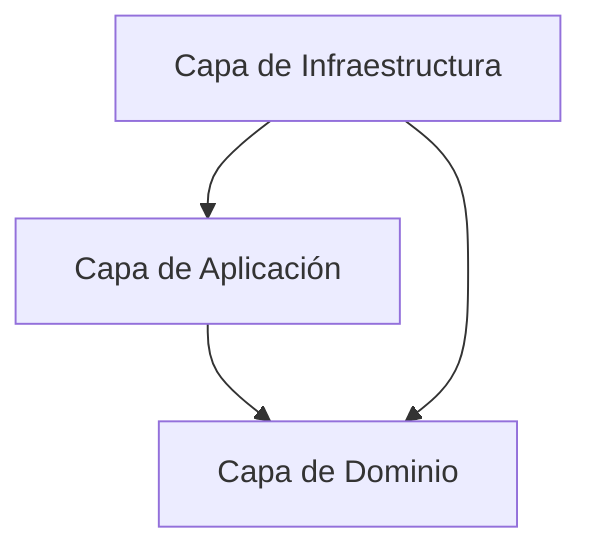

# ProyectosYA Backend - FastAPI

Este es el backend de ProyectosYA construido con FastAPI.
# ProyectosYA Backend - FastAPI

Este es el backend de ProyectosYA construido con FastAPI.

## Requisitos
- Python 3.12+
- [Docker Desktop](https://www.docker.com/products/docker-desktop/) instalado y corriendo

## Configuración inicial

Estos pasos solo se hacen **una vez** al clonar el proyecto.

### 1. Crear el archivo `.env`

Desde la raíz del monorepo:

```bash
cp .env.example .env
```

Abre `.env` y completa los valores. El archivo `.env` nunca se sube a Git — cada desarrollador tiene su propia copia local.

### 2. Crear entorno virtual
Desde `monorepo/backend/:`

```bash
python -m venv .venv
```

### 3. Activar el entorno virtual

- En Windows (PowerShell):
  ```powershell
  .venv\Scripts\Activate.ps1
  ```
- En macOS/Linux:
  ```bash
  source .venv/bin/activate
  ```

### 4. Instalar dependencias

```bash
pip install -r requirements.txt
```

---

## Cada vez que trabajes en el proyecto

```bash
# 1. Desde la raíz del monorepo — levantar la base de datos
docker compose up -d

# 2. Desde monorepo/backend/ — activar el entorno virtual
source .venv/bin/activate   # macOS/Linux
.venv\Scripts\Activate.ps1  # Windows

# 3. Iniciar el servidor
uvicorn app.main:app --reload
```

El servidor estará disponible en [http://127.0.0.1:8000](http://127.0.0.1:8000).

---

## Endpoints principales
- `GET /` — Mensaje de bienvenida
- `GET /health` — Estado del servicio
- `GET /docs` — Documentación interactiva (Swagger UI)
---

## Estructura de Carpetas

La arquitectura del backend sigue los principios de **Clean Architecture** (Arquitectura Limpia), separando la lógica de negocio de los detalles tecnológicos e infraestructura. La estructura del directorio `app/` es la siguiente:

```text
app/
├── main.py                 # Punto de entrada de la aplicación FastAPI y configuración global
├── domain/                 # Capa de Dominio: Lógica y conceptos fundamentales de negocio
│   ├── entities/           # Entidades del dominio (con identidad y lógica interna)
│   ├── models/             # Modelos de dominio y tipos de datos (e.g., Pydantic/dataclasses)
│   └── errors/             # Excepciones de negocio personalizadas
├── application/            # Capa de Aplicación: Casos de uso y reglas de aplicación
│   ├── useCases/           # Orquestadores de flujo de datos y lógica de casos de uso específicos
│   ├── repositories/       # Interfaces (clases abstractas) para el acceso a datos
│   ├── services/           # Servicios de aplicación que coordinan flujos complejos
│   └── rules/              # Reglas y validaciones específicas de la aplicación
└── infrastructure/         # Capa de Infraestructura: Detalles técnicos y adaptadores externos
    ├── repositories/       # Implementaciones concretas de las interfaces de repositories
    └── services/           # Implementaciones de servicios externos (APIs, LLM, notificaciones)
```

---

## Reglas de la Arquitectura (Clean Architecture)

Para asegurar la mantenibilidad y modularidad de la base de código, se deben respetar de forma estricta las siguientes reglas de dependencia:

### 1. Regla de Dependencia de Dirección Única
Las dependencias de código solo pueden apuntar hacia adentro (hacia el Dominio). Las capas externas conocen a las internas, pero las internas nunca deben saber de las externas.



* **Dominio (`app/domain`)**: Es el núcleo de la aplicación. No debe importar nada de las capas de `application` o `infrastructure`. Tampoco debe depender de frameworks externos (como FastAPI) ni de bases de datos/ORMs (como SQLAlchemy).
* **Aplicación (`app/application`)**: Contiene los casos de uso. Puede importar elementos de la capa `domain`. **NO** debe importar nada de la capa `infrastructure`.
* **Infraestructura (`app/infrastructure`)**: Contiene la implementación de los detalles tecnológicos. Puede importar elementos de las capas de `domain` y `application`.

### 2. Inversión de Dependencias
Cuando la capa de aplicación necesita guardar o recuperar datos (operación de infraestructura), no debe importar directamente la implementación de base de datos/infraestructura:
1. Se define una clase abstracta (interfaz) en `app/application/repositories/`.
2. La capa de aplicación interactúa únicamente con esta interfaz abstracta.
3. La capa de infraestructura implementa esta interfaz en `app/infrastructure/repositories/`.
4. La dependencia concreta se inyecta en tiempo de ejecución (por ejemplo, a través de dependencias en los endpoints de FastAPI).

### 3. Lógica y Excepciones
* Las validaciones de negocio e invariantes deben residir en `domain/` o `application/rules/`.
* Los errores específicos de negocio (e.g., recurso no encontrado, validación fallida) se deben definir en `app/domain/errors/` y ser lanzados desde el dominio/casos de uso, permitiendo que la capa externa (FastAPI en `main.py` o los enrutadores) los capture y traduzca a respuestas HTTP adecuadas.

---

## Estándar de Commits

Para mantener un historial de Git claro y facilitar la generación automática de changelogs, se adopta la convención de **Conventional Commits**.

### Formato de un Mensaje de Commit

Cada mensaje de commit debe seguir la siguiente estructura:

```text
<tipo>(<alcance>): <descripción corta y concisa en minúsculas>

[cuerpo del mensaje opcional con detalles más extensos]

[pie de página opcional para referenciar tickets o PRs, ej: Closes #123]
```

### Tipos de Commit (`<tipo>`)

* **`feat`**: Nueva funcionalidad para el usuario (e.g., `feat(api): agregar endpoint para actualizar perfil de empresa`).
* **`fix`**: Corrección de un error o bug (e.g., `fix(auth): corregir expiración del token JWT`).
* **`docs`**: Cambios exclusivos en la documentación (e.g., `docs(readme): añadir reglas de commits`).
* **`style`**: Cambios de estilo y formato que no afectan el comportamiento o lógica del código (formateo, comas, espacios, etc.).
* **`refactor`**: Reestructuración de código que no corrige errores ni añade características (e.g., refactorizar estructura de directorios).
* **`perf`**: Cambio de código orientado a mejorar el rendimiento de la aplicación.
* **`test`**: Añadir o modificar pruebas unitarias o de integración.
* **`chore`**: Tareas de mantenimiento, actualización de dependencias, configuración de herramientas, ruff/pyright configs, etc.

### Reglas Adicionales

1. **Mensaje corto**: La primera línea debe tener un máximo de 72 caracteres.
2. **Imperativo**: Utilizar verbos en infinitivo o imperativo en la descripción corta (ej. `añadir`, `corregir` o `agrega`, `corrige`).
3. **Alcance (`<alcance>`)**: Indica la parte afectada del proyecto (ej: `auth`, `api`, `matching`, `db`, `deps`, `docs`).

---

## Pruebas y TDD

El proyecto utiliza **Pytest** como framework de pruebas principal, integrado con la metodología **TDD (Test-Driven Development)**.

### Estructura del Directorio de Pruebas

Las pruebas se organizan bajo el directorio `tests/` en la raíz del backend:

```text
tests/
├── conftest.py          # Fixtures globales (cliente HTTPX, DB temporal, mocks)
├── unit/                # Pruebas Unitarias (Lógica aislada sin DB ni servicios externos)
│   ├── domain/          # Entidades y lógica del dominio
│   └── application/     # Casos de uso (useCases)
├── integration/         # Pruebas de Integración (Operaciones de base de datos, APIs de terceros)
│   ├── repositories/
│   └── services/
└── e2e/                 # Pruebas End-to-End (Simulación de llamadas de API HTTP completas)
    └── api/             # Endpoints y flujos de negocio completos
```

### Ejecutar Pruebas

Para ejecutar las pruebas del backend, asegúrate de activar el entorno virtual y ejecutar:

```bash
# Ejecutar todas las pruebas
pytest

# Ejecutar una prueba específica
pytest tests/e2e/api/test_main.py

# Ejecutar pruebas con reporte de cobertura (coverage)
pytest --cov=app
```


