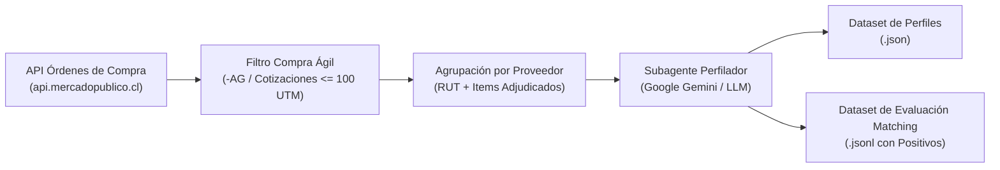

# Spike: Generador de Dataset de Compra Ágil y Perfilamiento de Proveedores

> 📄 **Informe Ejecutivo y Resultados del Benchmark:** Ver el reporte completo en [Spike 2: Evaluación y Mejora de Matching](../spike-2/README.md).

Este spike implementa un pipeline automatizado para conectarse a la API de Órdenes de Compra de **Mercado Público**, filtrar aquellas que corresponden a la modalidad **Compra Ágil**, procesar el historial de ventas mediante un **subagente inteligente (Gemini / Heurístico)** para perfilar a cada proveedor, y compilar un **dataset de evaluación y entrenamiento (Ground Truth)** para el motor de matching semántico.

---

## 1. Arquitectura del Pipeline



1. **Extracción:** Consulta las órdenes de compra emitidas en una fecha o ventana dada mediante el endpoint `ordenesdecompra.json`.
2. **Detección de Compra Ágil:**
   - Verifica el código de licitación asociado (`-AG`, sufijo de cotización ágil).
   - Analiza los campos `Tipo`, `TipoLicitacion` y metadatos de la orden.
3. **Subagente Perfilador (Structured Outputs con Pydantic):**
   - Toma el conjunto de órdenes ganadas por un mismo proveedor (`RUT`).
   - Analiza los nombres de productos, especificaciones del comprador, categorías y montos.
   - Utiliza **Structured Outputs** nativos de Google Gemini (`response_schema=SupplierProfileSynthesis`) para emitir directamente los campos originales del modelo `Supplier` / `CreateSupplierSchema` de ProyectosYA:
     - `rut`
     - `legal_name` y `trade_name`
     - `description` (30 a 1000 caracteres, densa y orientada a matching semántico)
     - `regions` (lista de regiones válidas de operación)
     - `sectors` (rubros de compras públicas)
     - `keywords` (términos clave y técnicos para búsqueda)
     - `certifications` (certificaciones detectadas)
     - `years_experience` y `num_employees`
   - **Beneficio:** Al usar el mismo esquema de dominio, no requiere parseo intermedio ni adaptadores; la instancia generada por el subagente se puede cargar directamente a la base de datos o al pipeline de embeddings.
4. **Búsqueda y Almacenamiento de Compras Ágiles:**
   - Por cada Orden de Compra filtrada, consulta la API de Mercado Público (`api2.mercadopublico.cl/v2/compra-agil/{id}`) o el endpoint de licitaciones para extraer la ficha técnica del requerimiento.
   - Normaliza la compra ágil a la estructura `CompraAgilTender` (compatible con la entidad `Tender` de ProyectosYA: `code`, `name`, `description`, `buyer_name`, `region`, `items`, etc.).
5. **Exportación de Artefactos:**
   - `dataset_compra_agil_proveedores.json`: Dataset consolidado por empresa con su perfil `Supplier`, sus OCs y las Compras Ágiles adjudicadas asociadas.
   - `compras_agiles_para_matching.json`: Catálogo completo de las Compras Ágiles recolectadas en formato compatible con `Tender`, listo para ser indexado en Qdrant o pasar por el pipeline de matching (`rank_tenders.py`).
   - `benchmark_matching_ground_truth.jsonl`: Archivo optimizado para calcular métricas de ranking (`NDCG@10`, `Precision@5`, `Recall@10`), donde cada línea contiene el proveedor y sus `positive_tender_ids` reales.

---

## 2. Requisitos y Configuración

El script reutiliza las mismas variables de entorno ya definidas en el proyecto:
* `MERCADO_PUBLICO_API_KEY`: Ticket de acceso a la API de Mercado Público.
* `GEMINI_API_KEY`: Clave de API de Google Gemini (si no está presente o falla, el script utiliza un perfilador heurístico de respaldo automático).

---

## 3. Modos de Ejecución

### Opción A: Prueba Rápida en Modo Mock (Simulado)
Permite validar el pipeline completo con el número deseado de proveedores y OCs sin consumir llamadas de red a la API:

```bash
python spikes/dataset_compra_agil/generar_dataset_compra_agil.py --mock --suppliers 3 --min-oc-per-supplier 2
```

### Opción B: Extracción Real de Mercado Público
Descarga órdenes de compra de Mercado Público, filtra Compra Ágil hasta completar los proveedores y OCs requeridos:

```bash
python spikes/dataset_compra_agil/generar_dataset_compra_agil.py --suppliers 10 --min-oc-per-supplier 3 --fecha 20092026
```

### Parámetros Disponibles:
* `--suppliers`: **Número de empresas a evaluar** en esta ejecución (por defecto: `5`).
* `--min-oc-per-supplier`: **Número mínimo de órdenes de compra** que debe tener cada proveedor en el test; define además cuántas OCs se fetchean y analizan por cada uno (por defecto: `2`).
* `--reset`: **Reinicia y borra** los archivos generados previamente (`dataset_compra_agil_proveedores.json`, `compras_agiles_para_matching.json`, `benchmark_matching_ground_truth.jsonl`) para comenzar desde cero. **Si no se incluye esta bandera, las ejecuciones sucesivas acumulan automáticamente** nuevos proveedores y licitaciones sin duplicar.
* `--fecha`: Fecha en formato `DDMMAAAA` (puedes pasar varias separadas por coma, ej: `--fecha 15092026,16092026`).
* `--limit`: Límite máximo de OCs a inspeccionar en detalle por cada fecha.
* `--output-dir`: Directorio donde se guardarán los datasets generados (por defecto `spikes/dataset_compra_agil/data/`).
* `--ticket`: Opcional si ya está en el archivo `.env`.
* `--gemini-key`: Opcional si ya está en el archivo `.env`.

---

## 4. Uso del Dataset para Entrenar / Evaluar Matching

El archivo generado `benchmark_matching_ground_truth.jsonl` tiene el formato estándar para pruebas de ranking:

```json
{
  "supplier_id": "76.123.456-7",
  "supplier_name": "Distribuidora Médica y Quirúrgica del Sur SpA",
  "trade_name": null,
  "query_text_rubro": "Insumos Médicos y Clínicos, Comercialización y Suministros del Estado",
  "query_text_descripcion": "Proveedor especializado en la distribución de material descartable hospitalario, insumos clínicos...",
  "query_keywords": ["guantes", "alcohol", "quirúrgico", "esteril", "mascarillas"],
  "regiones": ["Región del Libertador General Bernardo O'Higgins"],
  "sectors": ["Insumos Médicos y Clínicos", "Comercialización y Suministros del Estado"],
  "years_experience": 3,
  "num_employees": 5,
  "positive_tender_ids": ["757-45-COT26", "1024-12-COT26"]
}
```

Con este dataset puedes:
1. Pasar `query_text_descripcion` + `query_keywords` por el pipeline de matching (`rank_tenders.py`).
2. Medir si los `positive_tender_ids` aparecen en las primeras posiciones del ranking ($K \le 5$).
3. Calcular métricas objetivas de precisión (`NDCG@K`, `Hit Rate@K`).
